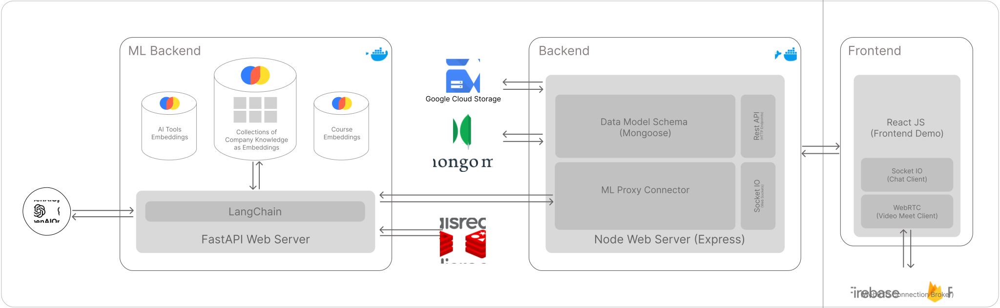

# Synth Bridge



## Setup
Download the following files from drive
- `.env` (See `.env.example`) - rename the sample `.env.example` to `.env`, and keep in base directory
- `gcp-key.json` (Use your own from Google Cloud) - keep in base directory
  - You need to create a bucket named `synth-bridge` in Google Cloud Storage. [Here](https://cloud.google.com/storage/docs/creating-buckets) is a reference. 
- course-db.zip [`here`](https://drive.google.com/file/d/1dPLjW_nXaptlp2Ky6fgB1mPQXkX-ovXa/view?usp=drive_link) - extract then move the folder inside `ml-endpoint`
- taaft-db.zip [`here`](https://drive.google.com/file/d/1y4ktqoHdB5uk2ii8vhydky2T34kVMZu4/view?usp=drive_link) - extract and then move the folder inside `ml-endpoint`

- Note: The zip files are in the folder shared for adding Team_96 's submission.

## Run Docker containers
```bash
docker compose up --build
```

## Troubleshooting
- If `docker compose` command is not found, use `docker-compose` instead.
- If the dockerfile for frontend doesn't run, manually run the frontend using 
```bash
cd frontend; npm i; npm run dev
```
- If there are issues with the REST API calls, please try switching the browser.

## Contributors

<table>
  <tbody>
    <tr>
      <td align="center" valign="top" width="14.28%">
        <a href="https://github.com/PrakharIITB">
          
          <br />
          <sub>
            <b>PrakharIITB</b>
          </sub>
        </a>
        <br />
      </td>
      <td align="center" valign="top" width="14.28%">
        <a href="https://github.com/shiveshcodes">
          
          <br />
          <sub>
            <b>shiveshcodes</b>
          </sub>
        </a>
        <br />
      </td>
      <td align="center" valign="top" width="14.28%">
        <a href="https://github.com/abhijit424515">
          
          <br />
          <sub>
            <b>abhijit424515</b>
          </sub>
        </a>
        <br />
      </td>
      <td align="center" valign="top" width="14.28%">
        <a href="https://github.com/aksh-at10">
          
          <br />
          <sub>
            <b>aksh-at10</b>
          </sub>
        </a>
        <br />
      </td>
      <td align="center" valign="top" width="14.28%">
        <a href="https://github.com/aasuss">
          
          <br />
          <sub>
            <b>aasuss</b>
          </sub>
        </a>
        <br />
      </td>
    </tr>
  </tbody>
</table>
